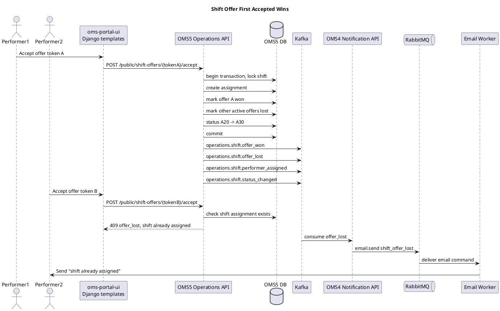
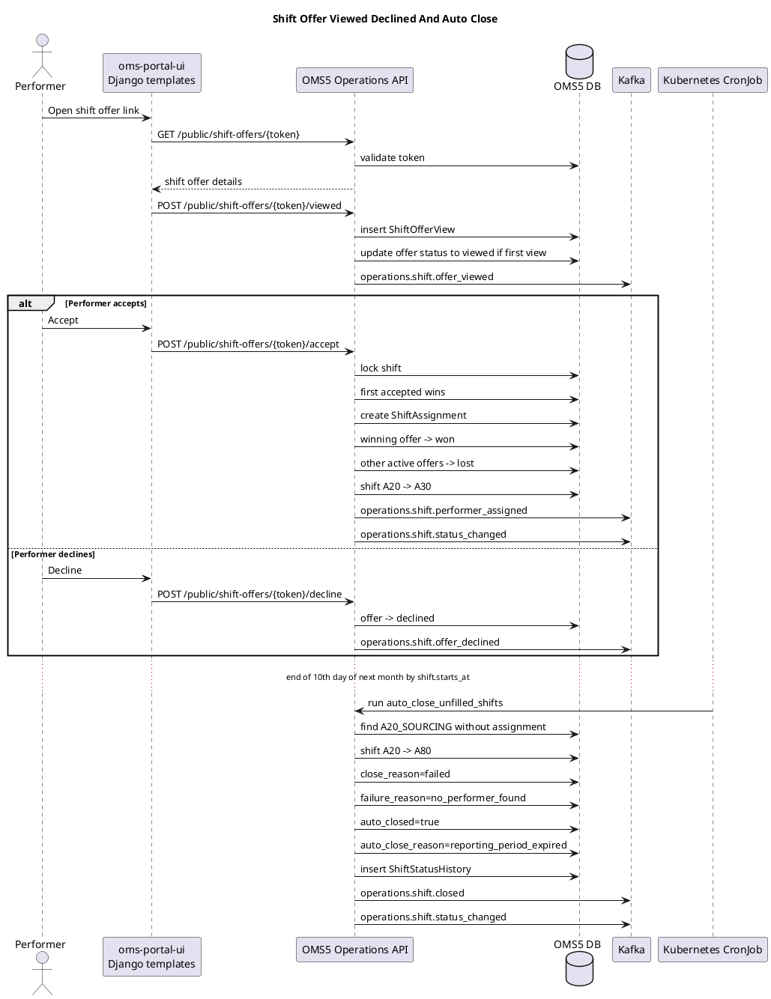

# OMS5 Shift Domain Design

Документ фиксирует проектные решения по укрупнению `OMS5` вокруг бизнес-сущности `Shift` и нужен для последующей проверки плана и факта реализации.

Статус: design baseline, реализация не начата.

## Цели

- Убрать термин `Task`/`Задание` из операционного домена.
- Привести терминологию к единому понятию `Смена` / `Shift`.
- Разделить пользователей портала и исполнителей.
- Расширить статусную модель смен через FSM.
- Спроектировать обмен событиями через Kafka.
- Добавить RabbitMQ как shared command queue для lightweight workers.
- Зафиксировать границы `OMS5`, `OMS2`, `OMS4`, `oms-admin-ui`, `oms-portal-ui`.

## Терминология

| Термин | Английский термин | Владелец | Описание |
| --- | --- | --- | --- |
| Смена | `Shift` | `OMS5` | Центральная бизнес-сущность операционного контура |
| Задание | deprecated | none | Устаревший синоним смены, больше не используется |
| Исполнитель | `Performer` | `OMS5` projection, source in `OMS2.Employee` | Человек, который может быть назначен на смену |
| Сотрудник | `Employee` | `OMS2` | Master data физического лица |
| Пользователь портала | `User` | `OMS1` | Аккаунт для входа в систему и ролей |
| Табель | `Timesheet` | `OMS5` | Результат подтверждения факта работы по смене |

Роли пользователей портала:

```text
Администратор
Супервайзер
Менеджер
```

Пользователь портала и исполнитель могут опираться на одну запись `Employee`, но это разные роли в системе.

## Service Ownership

| Service / Repo | Ответственность |
| --- | --- |
| `OMS1` | users, roles, auth, JWT, `user -> employee_id` |
| `OMS2` | `Employee` master data |
| `OMS5` | clients, shifts, performer projection, offers, assignments, timesheets, FSM |
| `OMS4` | notification templates, email delivery, email delivery results |
| `oms-admin-ui` | внутренний Django templates UI для администраторов, супервайзеров и менеджеров |
| `oms-portal-ui` | Django templates UI для публичных страниц исполнителя |
| `oms-platform` | Kafka, RabbitMQ, contracts, k8s manifests, docs |

`OMS5` владеет `Shift API`. UI не владеет данными и работает как API client.

## UI Decisions

Используем отдельные репозитории:

```text
oms-admin-ui
oms-portal-ui
```

Технология MVP:

```text
Django templates
```

`oms-admin-ui`:

- CRUD смен через `OMS5 API`;
- импорт смен;
- подбор исполнителей;
- запуск offer campaigns;
- ручное назначение/снятие исполнителя;
- проверка табеля;
- обработка `absence`;
- просмотр `ShiftStatusHistory`.

`oms-portal-ui`:

- public page предложения смены;
- просмотр деталей смены;
- `viewed`, `accept`, `decline` через одноразовый token;
- в будущем личный кабинет исполнителя.

## Canonical Shift FSM

Канонические фазы:

| Code | Label | Meaning |
| --- | --- | --- |
| `A00_DRAFT` | Создание | Черновик смены |
| `A10_CONFIRM` | Подтверждение | Смена подтверждается клиентом/агентством |
| `A20_SOURCING` | Подбор исполнителя | Идет подбор исполнителя |
| `A30_CHOICE` | Ожидание начала смены | Исполнитель выбран и забронирован |
| `A40_EXECUTION` | Исполнение | Смена исполняется |
| `A50_VERIFY` | Проверка / подтверждение табеля | Проверяется факт работы и табель |
| `A60_SETTLE` | Оплата | Расчеты и оплата |
| `A70_CONFIRM` | Закрывающие документы | Согласование закрывающих документов для клиента |
| `A80_CLOSED` | Закрыта | Paid / Canceled / Failed / Deleted |
| `A90_ARCHIVE` | Архив | Архивная смена |

Переходы:

```text
A00_DRAFT -> A10_CONFIRM
A10_CONFIRM -> A20_SOURCING
A20_SOURCING -> A30_CHOICE
A30_CHOICE -> A20_SOURCING
A30_CHOICE -> A40_EXECUTION
A40_EXECUTION -> A50_VERIFY
A50_VERIFY -> A60_SETTLE
A50_VERIFY -> A80_CLOSED
A60_SETTLE -> A70_CONFIRM
A70_CONFIRM -> A80_CLOSED
A30_CHOICE -> A80_CLOSED
A20_SOURCING -> A80_CLOSED
A80_CLOSED -> A90_ARCHIVE
```

Не делаем переход `A50_VERIFY -> A40_EXECUTION`. Если проверка показала прогул, смена остается в `A50_VERIFY` до ручного решения менеджера.

## Close Reasons

Для `A80_CLOSED` используем:

```text
close_reason:
- paid
- canceled
- failed
- deleted
```

Для неуспешного закрытия:

```text
failure_reason:
- absence
- no_performer_found
- client_rejected
- timesheet_invalid
- manual_admin_decision
```

Канонический вариант для прогула:

```text
absence
```

Для автоматического закрытия:

```text
auto_closed: true
auto_close_reason: reporting_period_expired
closed_by: system
```

## Absence Flow

Если есть подозрение на прогул:

```text
A40_EXECUTION -> A50_VERIFY
```

Смена остается в `A50_VERIFY` до ручной проверки менеджером.

Поля:

```text
verification_required = true
verification_reason = absence_suspected
```

OMS5 инициирует уведомление менеджеру:

```text
RabbitMQ command: email.send
templateCode: shift_absence_review_required
```

После ручного подтверждения:

```text
A50_VERIFY -> A80_CLOSED
close_reason = failed
failure_reason = absence
```

## Reporting Period And Auto Close

Отчетный период считается по:

```text
shift.starts_at
```

Дата закрытия отчетного периода:

```text
reporting_period_close_date = 10 число месяца, следующего за месяцем shift.starts_at
```

Автозакрытие выполняется:

```text
в конце 10-го числа
```

Запрещаем создание смен задним числом после закрытия отчетного периода:

```text
if now > reporting_period_close_datetime(shift.starts_at):
    reject with 409 reporting_period_closed
```

Kubernetes CronJob ежедневно запускает management command/script OMS5, например:

```text
python -m app.management.auto_close_unfilled_shifts
```

Логика auto close:

- найти смены в `A20_SOURCING`;
- проверить, что reporting period закрыт;
- проверить, что assignment отсутствует;
- перевести в `A80_CLOSED`;
- записать `ShiftStatusHistory`;
- опубликовать Kafka events.

## Domain Model Draft

```text
Client
- id
- name
- external_id

Shift
- id
- client_id
- status
- starts_at
- ends_at
- location
- required_performers_count = 1
- assigned_performer_id
- close_reason
- failure_reason
- auto_closed
- auto_close_reason
- created_by_user_id
- created_at
- updated_at

Performer
- id
- employee_id
- display_name
- email
- phone
- status
- source_version
- synced_at

ShiftStatusHistory
- id
- shift_id
- from_status
- to_status
- transition_code
- reason
- actor_user_id
- occurred_at
- correlation_id
- metadata_json

ShiftOfferCampaign
- id
- shift_id
- status
- created_by_user_id
- created_at

ShiftOffer
- id
- campaign_id
- shift_id
- performer_id
- status
- token_hash
- expires_at
- sent_at
- responded_at

ShiftOfferView
- id
- offer_id
- viewed_at
- ip_address
- user_agent
- correlation_id

ShiftAssignment
- id
- shift_id
- performer_id
- offer_id
- status
- assigned_at
- removed_at
- reason

Timesheet
- id
- shift_id
- performer_id
- work_date
- hours
- status
```

Одна смена имеет одного исполнителя. Предлагать смену можно нескольким исполнителям.

MVP rule:

```text
first accepted wins
```

Будущий конкурс между откликами исполнителей уходит в backlog.

## Performer Projection Sync

`Employee` master data живет в `OMS2`.

`OMS5` хранит локальную `Performer` projection и обновляет ее через Kafka events:

```text
employee.created
employee.updated
employee.deactivated
```

Поток:

```text
OMS2 Employee -> Kafka -> OMS5 Performer projection
```

После обновления projection `OMS5` может публиковать:

```text
operations.performer.created
operations.performer.updated
```

## Offers And Public Tokens

Смена может быть предложена нескольким исполнителям через offer campaign.

Offer statuses:

```text
draft
sent
viewed
accepted
declined
won
lost
expired
cancelled
```

Token TTL:

```text
expires_at = shift.starts_at
```

Public API:

```text
GET  /public/shift-offers/{token}
POST /public/shift-offers/{token}/viewed
POST /public/shift-offers/{token}/accept
POST /public/shift-offers/{token}/decline
```

Правила:

- `GET` только показывает данные;
- `POST /viewed` фиксирует просмотр;
- каждый просмотр логируется в `ShiftOfferView`;
- `viewed` логируется даже если token истек, offer lost/expired или shift уже занята;
- если token неизвестен, возвращаем `404`;
- `accept` является transactional command;
- если смена уже занята, второй исполнитель получает `409 offer_lost`;
- `decline` публикует только Kafka event, email менеджеру не отправляется.

Rule:

```text
Viewed is analytics, not availability confirmation.
Accept is transactional.
```

## Kafka Events

Kafka хранит события как durable event log в пределах настроенной retention policy.

Employee sync:

```text
employee.created
employee.updated
employee.deactivated
```

Performer projection:

```text
operations.performer.created
operations.performer.updated
```

Shift lifecycle:

```text
operations.shift.created
operations.shift.confirmed
operations.shift.sourcing_started
operations.shift.started
operations.shift.finished
operations.shift.closed
operations.shift.archived
operations.shift.status_changed
```

Offers:

```text
operations.shift.offer_campaign_created
operations.shift.offer_sent
operations.shift.offer_viewed
operations.shift.offer_accepted
operations.shift.offer_declined
operations.shift.offer_won
operations.shift.offer_lost
operations.shift.offer_expired
operations.shift.offer_cancelled
```

Assignment and timesheet:

```text
operations.shift.performer_assigned
operations.shift.assignment_cancelled
operations.timesheet.submitted
operations.timesheet.verified
```

Notifications:

```text
notification.email_status
```

## RabbitMQ Commands

RabbitMQ является shared platform component для command/task queues.

Используем lightweight Python workers, без Celery.

Commands:

```text
email.send
report.build
```

Queues:

```text
oms4.email.send
oms4.email.send.retry
oms4.email.send.dlq
oms3.report.build
oms3.report.build.retry
oms3.report.build.dlq
```

Kafka не используется как command queue.

## OMS4 Email Templates

Шаблоны email хранятся в БД OMS4.

Минимальная модель:

```text
EmailTemplate
- id
- code
- subject_template
- body_template
- locale
- version
- is_active
- created_at
- updated_at
```

MVP template codes:

```text
shift_offer
shift_offer_accepted
shift_offer_lost
shift_assignment_confirmed
shift_assignment_cancelled
shift_absence_review_required
shift_reminder
timesheet_required
report_ready
```

## Sequence Diagrams

### Offer Acceptance First Accepted Wins



### Viewed Declined And Auto Close



## Backlog

- Конкурс между откликами исполнителей.
- Performer personal account в `oms-portal-ui`.
- Расширенная аналитика просмотров offer pages.
- RabbitMQ monitoring и DLQ management UI.
- Event sync conflict handling для `Performer` projection.
- React UI при росте продукта.

## Plan / Fact Checklist

| Item | Planned | Implemented | Notes |
| --- | --- | --- | --- |
| Rename `Task` terminology to `Shift` | Yes | No | Remove `Task` from OMS5 docs/API/model |
| Add `Shift` FSM | Yes | No | Include status validation |
| Add `ShiftStatusHistory` | Yes | No | Required from first MVP |
| Add `Performer` projection in OMS5 | Yes | No | Synced from OMS2 via Kafka |
| Add `employee.updated` consumer in OMS5 | Yes | No | Event sync projection |
| Add offer campaign model | Yes | No | Multiple offers for one shift |
| Add one-time public token | Yes | No | TTL until shift starts |
| Add viewed tracking | Yes | No | Log every view |
| Add first accepted wins transaction | Yes | No | Must be atomic |
| Add RabbitMQ platform component | Yes | No | Shared for OMS3/OMS4 workers |
| Add lightweight OMS4 email worker | Yes | No | No Celery |
| Add lightweight OMS3 report worker | Yes | No | No Celery |
| Add OMS4 email templates in DB | Yes | No | Required for MVP |
| Add auto close CronJob | Yes | No | End of 10th day next month |
| Add `oms-admin-ui` repo | Yes | No | Django templates |
| Add `oms-portal-ui` repo | Yes | No | Django templates |
